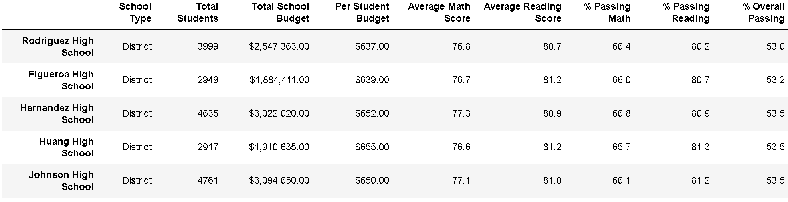
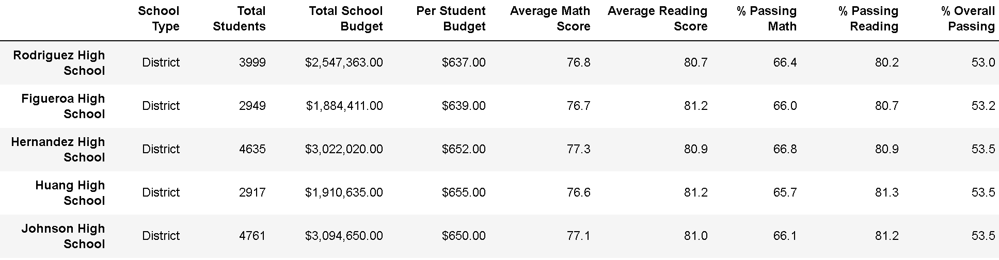

# School_District_Analysis

### Overview of the school district analysis

The purpose of this analysis was to provide detailed information for the performance of high school students on final examinations for reading and math in a given school district. After the discovery of grade tampering, a new analysis was performed to provide a new set of data to better reflect the actual performance of students. 

### Results
 Using bulleted lists and images of DataFrames as support, address the following questions.

- How is the district summary affected?

- How is the school summary affected? 

- How does replacing the ninth graders’ math and reading scores affect Thomas High School’s performance relative to the other schools?

- How does replacing the ninth-grade scores affect the following:

  - Math and reading scores by grade:

 
  - Scores by school spending 

  - Scores by school size: 

  - Scores by school type:

### Summary

Summarize four changes in the updated school district analysis after reading and math scores for the ninth grade at Thomas High School have been replaced with NaNs.
