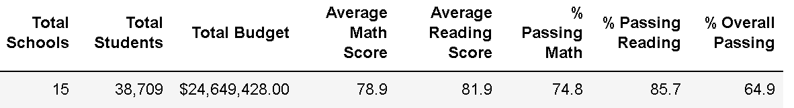

# School_District_Analysis

### Overview of the school district analysis

The purpose of this analysis was to provide detailed information for the performance of high school students on final examinations for reading and math in a given school district. After the discovery of grade tampering, a new analysis was performed to provide a new set of data to better reflect the actual performance of students. 

### Results

- Overall the district summary changes when you alter the data of Thomas High School (THS) as seen in the next two figures below:
  - The newly calculated results are shown below.
  

  
  - The original data, shown below, when compared to that above, there is a small decrease in overall performance in all categories except the total amount of schools and budget.

- The school summary data was also affected by this altering of data. 
  - In the original data THS had a lower overall passing ercentage, seen below.

  - When the data was altered to remove the 9th grade, shown below, THS increased its overall passing performance, as well as its average reading score, passing math percentage, and reading percentage.

- Replacing the ninth graders’ math and reading scores affects THS’s performance relative to the other schools in that It moves from the second ranked highest school to the highest school as seen in the following figures.
  - As you can see in the figure below, THS is ranked first in performance based on the overall passing percentage.

  - This is an increase from the original data that included the 9th grade student data as shown below.

 
When replacing the 9th grade scores the following were affected:

  - The math scores by each grade were unaffected other than the 9th grade for THS being replaced with nan, which stands for not a number. 
    - Scores of grades after data being altered:

  - The original data:

  - The reading scores by each grade were also unaffected by the altering of the data with the exception of THS' 9th grade.
    - Original data:

    - Altered data:

 
  - Scores by school spending 

  - There were no changes to the scores when looking at the data by school size: 
    - Altered data:

    - Original data:

  - When analyzing the data by school type, there is a small overall passing percentage increase to charter schools when the data is altered, as seen below.

    - The original data by comparison  is shown below.

### Summary

The updated school district analysis after the reading and math scores for the ninth grade at Thomas High School were replaced with NaNs is quite significant.
